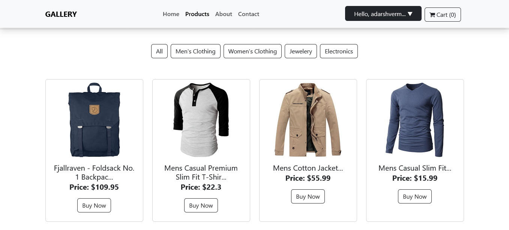
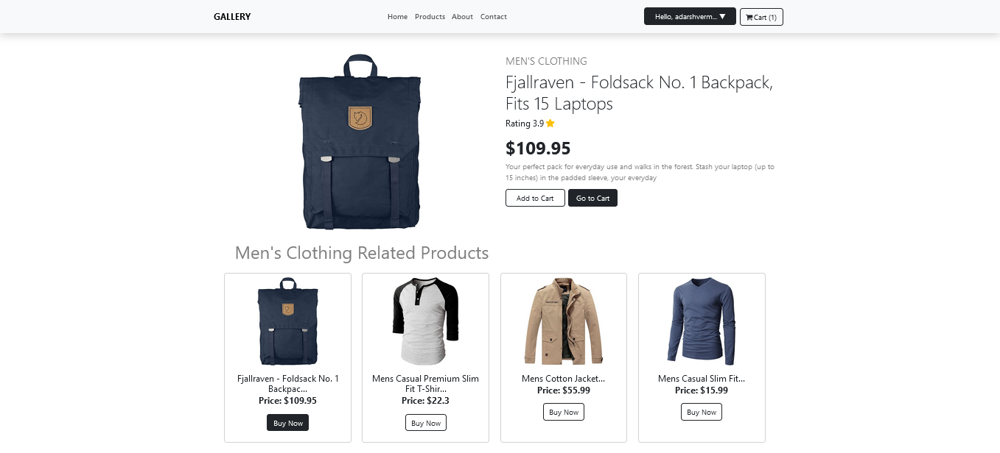
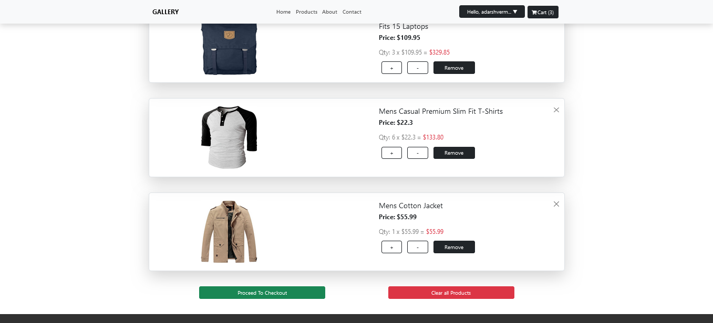
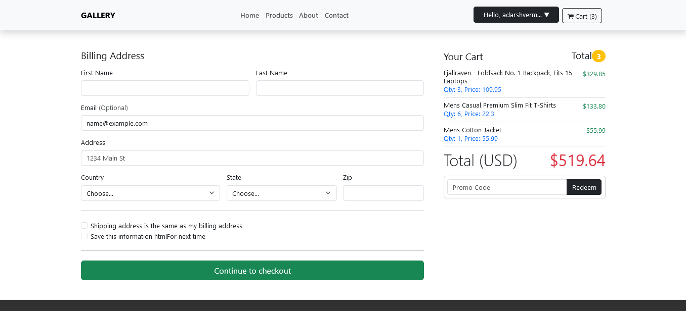

# E-Commerce Website with React


This repository contains the source code for an E-Commerce website built using React. The website offers a user-friendly interface for customers to browse products, add them to the cart, and complete their purchases securely.









## Features

- **Product Catalog**: Browse a wide range of products organized into categories.
- **Product Details**: View detailed information about each product, including images, descriptions, and specifications.
- **Search and Filters**: Easily find products using the search bar and apply filters based on categories and attributes.
- **Shopping Cart**: Add products to the cart and review the selected items before proceeding to checkout.
- **User Authentication**: Allow users to sign up, log in, and manage their accounts.
- **Secure Checkout**: Provide a secure checkout process for customers to complete their purchases.
- **Order History**: Users can view their order history and track the status of their orders.
- **Admin Dashboard**: Administrators can manage products, categories, and orders using a dedicated dashboard.

## Technologies Used

- React for building the user interface.
- React Router for managing routes and navigation.
- Redux for state management.
- Axios for making HTTP requests.
- @reduxjs/toolkit install and used with react-redux.

## Getting Started

1. Clone the repository:

```sh
  git clone https://github.com/AdarshTheki/Ecommerce-website.git
  cd Ecommerce-website
```

2. Start the development server:

```sh
  npm install
```

3. Open the website in your browser:

```sh
  npm run dev
  http://localhost:5173
```

## Contributing

Contributions are welcome! If you'd like to contribute to this project, please follow these steps:

1. Fork the repository.
2. Create a new branch: `git checkout -b my-new-branch`
3. Make your changes.
4. Commit your changes: `git commit -m 'Add some feature'`
5. Push the branch: `git push origin my-new-branch`
6. Submit a pull request.

## License

This project is licensed under the MIT License - see the **[LICENSE](./LICENSE)** file for details.

## Descriptions
This README file outlines the key features, getting started instructions, technologies used, and how to contribute to the project. Make sure to include your own screenshots, links, and detailed descriptions that accurately represent your eCommerce website built with React.

Happy Coding...😍

---
